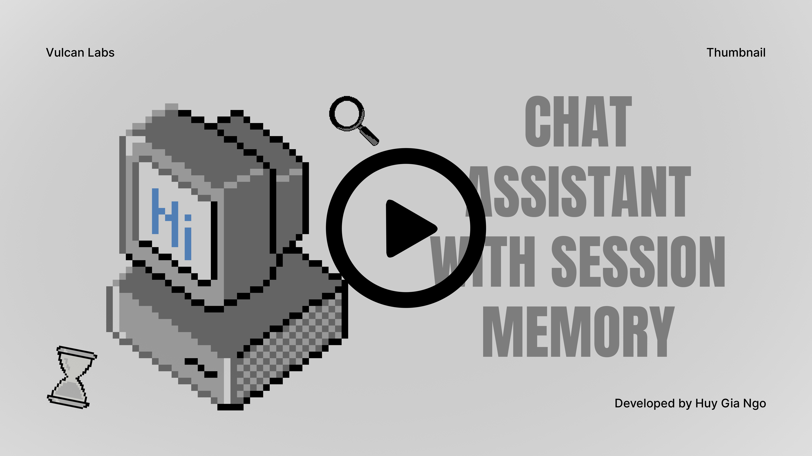

# 🧠 Chat Assistant with Session Memory


> A personalized AI assistant that remembers your preferences, clarifies ambiguities, and maintains context across sessions.

## Table of Contents
*   [Introduction](#introduction)
*   [Live Demo](#live-demo)
*   [System Architecture](#system-architecture)
*   [Installation & Setup](#installation--setup)
    *   [Prerequisites](#prerequisites)
    *   [Configuration](#configuration)
    *   [Installation Options](#installation-options)
*   [Usage & Testing](#usage--testing)
*   [Project Structure](#project-structure)
*   [Assumptions & Limitations](#assumptions-&-limitations)
*   [Acknowledgments](#acknowledgments)

---

## Introduction

In the era of Large Language Models (LLMs), a significant limitation persists: **"The Goldfish Memory" problem**. Standard LLM interactions are stateless; once a conversation window closes, the model forgets everything about the user. This prevents the creation of truly personalized, long-term AI companions.

**Chat Assistant with Session Memory** is an engineered solution designed to bridge this gap. It is not just a chatbot wrapper, but a **state-aware system** that introduces a persistent memory layer and intelligent query processing pipelines.

Unlike generic chatbots, this system is built to:
1.  **Remember:** It actively extracts and consolidates key facts (e.g., *"User is a DevOps Engineer"*, *"User prefers Python over Java"*) into a persistent storage, making future interactions more personalized.
2.  **Understand:** It implements **Contextual Query Rewriting**, allowing it to understand implicit references like *"fix it"* or *"rewrite that"* based on previous dialogue history.
3.  **Clarify:** It detects **Ambiguity** (Polysemy). Instead of guessing when a user asks to *"Open a bank"* (Financial vs. River), it proactively asks clarifying questions to ensure accuracy.

This project serves as a comprehensive demonstration of building **Context-Aware AI Applications** using **Python**, **Streamlit**, and **OpenAI**, fully containerized with **Docker** for production-grade reproducibility.


## Live Demo
[](https://youtu.be/kO16Jg7eCCM)
> Click to watch the full demo on YouTube

## System Architecture


The system architecture is designed as a **modular processing pipeline** that decouples *interaction logic* from *state management*. It operates on two distinct workflows: the synchronous **Inference Loop** (handling user queries) and the asynchronous-like **Memory Consolidation Loop** (managing short-term storage).

### 1. The Inference Loop (Hot Path)
This flow handles real-time user interaction. It ensures every query is contextualized before generating an answer.

* **Context Injection (Context Loader):** At the start of every turn, the system retrieves the latest `User Profile` and `Session Summary` from the **Persistent Storage** (JSON). This context is injected into the pipeline.
* **Ambiguity Check (Guardrail):** The raw user input is first analyzed for polysemy (e.g., "bank") or vague references.
    * *If Ambiguous:* The flow halts, and the UI requests clarification from the user.
    * *If Clear:* The query proceeds to the next step.
* **Query Rewriter (Normalization):** The system resolves linguistic dependencies (anaphora resolution). For example, it converts *"fix it"* into *"fix the Python code"* using the injected context.
* **Chat Generator:** The final LLM node generates a response based on the fully rewritten query and the consolidated memory.

### 2. The Memory Consolidation Loop (Cold Path)
To prevent context window overflow and maintain performance, memory management is handled conditionally.

* **Threshold Monitor:** After every interaction, the system checks the current conversation token count against a pre-defined limit.
* **Memory Manager:** Triggered only when the limit is exceeded. It extracts key entities (Facts, Preferences) and summarizes the recent conversation chunk.
* **Persistent Storage:** The consolidated data is serialized into a local JSON file (`session_memory.json`), ensuring the "brain" survives application restarts.


## Installation & Setup

### Prerequisites
* **Docker & Docker Compose** (Recommended)
* Or Python 3.12+ (For local execution)
* OpenAI API Key

### Configuration
1.  Clone the repository.
    ```bash
    git clone https://github.com/gitHuyNgo/chat-assistant-session-memory.git
    cd chat-assistant-session-memory
    ```
2.  Create your environment file:
    ```bash
    cp .env.example .env
    ```
3.  Add your API Key to `.env`:
    ```ini
    OPENAI_API_KEY=sk-proj-xxxxxxxx...
    ```
### Installation Options
You can choose one of the following methods to install the dependencies:
#### Option A: Docker
This is the **recommended** method as it handles all system dependencies automatically.
```bash
# Build the image and start the container
docker-compose up --build -d
```
#### Option B: Local Python Setup
```bash
# 1. Create a virtual environment
python -m venv venv

# 2. Activate the virtual environment
# On Windows:
venv\Scripts\activate
# On macOS/Linux:
source venv/bin/activate

# 3. Install dependencies
pip install -r requirements.txt
```

## Usage & Testing
Once the application is up and running, you can interact with it via the Web UI or the CLI.
### 🖥️ Mode 1: Interactive Web UI
If you followed the installation steps, the web interface is accessible at:
👉 **[http://localhost:8501](http://localhost:8501)**

#### Demo Walkthrough
To verify the core requirements quickly, use the **Test Scenarios** panel in the sidebar:

**1. Ambiguity Handling (Flow 2)**
* **Action:** Click the `Ambiguity` button.
* **Scenario:** Loads the query *"I want to open a bank"*.
* **Outcome:** The system detects the polysemy (Financial vs. River) and presents clickable **Clarification Pills** instead of guessing.

**2. Context Awareness**
* **Action:** Click the `Context` button.
* **Scenario:** Loads a history where the user dislikes Java and loves Python.
* **Outcome:** When you ask *"Write code for it"*, the system automatically generates **Python** code, proving it understands the implicit context.

**3. Memory Consolidation (Flow 1)**
* **Action:** Click the `Memory` button.
* **Scenario:** Simulates a long conversation to fill the token buffer.
* **Outcome:**
    1.  The **Buffer Usage** bar hits 100%.
    2.  A background summarization process is triggered.
    3.  The **Consolidated Memory** expander updates with new facts (e.g., *Job: DevOps, Interest: AI*).
    4.  A `session_memory.json` file is persisted in the `data/` directory.

---
### ⌨️ Mode 2: CLI Validation

You can execute the evaluation flows directly from the command line. This is useful for CI/CD pipelines or headless testing.

**Note:** If running with Docker, use `docker-compose run` to execute commands inside the isolated container.

#### Test Flow 1: Memory & Summarization
Run a simulation of a long user session to test the memory manager.
```bash
docker-compose run --rm ai-assistant python app/cli.py run-log tests/data/long_session.json
```

#### Test Flow 2: Ambiguity Detection
Run the specific ambiguity test case.
```bash
docker-compose run --rm ai-assistant python app/cli.py run-log tests/data/ambiguous.json
```

#### Test Flow 3: Instant Extraction
Run the specific instant extraction test case.
```bash
docker-compose run --rm ai-assistant python app/cli.py run-log tests/data/context.json
```


## Project Structure
```plaintext
.
├── app/
│   ├── ui.py              # Main Streamlit Application (Frontend)
│   └── cli.py             # CLI Entry point (Testing/CI)
├── src/
│   ├── core/              # Core Logic (Memory Manager, Pipeline, Generator)
│   ├── schemas/           # Pydantic Models (Data Validation)
│   └── utils/             # Helpers (Tokenizer, Storage)
├── tests/data/            # JSON Simulation logs (Test Cases)
├── data/                  # Persistent Storage (Generated at runtime)
├── Dockerfile             # Container Definition
└── docker-compose.yml     # Orchestration
```

## Assumptions & Limitations

To manage the scope of this prototype, the following constraints apply:

* **Latency & Overhead:** The system executes a sequential "Thought Pipeline" (Analysis → Rewriting → Generation) for every turn, resulting in higher response times and token usage compared to standard chatbots.
    * *Roadmap: Optimize logic steps by utilizing distilled models (e.g., GPT-4o-mini) or implementing semantic caching.*
* **Concurrency:** Uses local JSON (`session_memory.json`) for persistence, which is not thread-safe for multiple concurrent users.
    * *Roadmap: Migrate to PostgreSQL/Redis for production.*
* **Context Window:** Long conversations rely on summarization, potentially losing minor details.
    * *Roadmap: Implement Vector Database (RAG) for semantic search retrieval.*
* **Single User:** Designed as a personal assistant; currently lacks authentication and multi-user segregation.


## Acknowledgments
This project demonstrates a pragmatic approach to AI-assisted development:

* **Core Architecture & Logic:** The core logic, including the Memory Consolidation flows, Ambiguity handling, and System Architecture, was derived entirely from my own brainstorming and design.
* **Implementation Support:** I utilized AI tools to accelerate the implementation of the **CLI & Streamlit UI** layers and to refactor the code for better readability and structure.